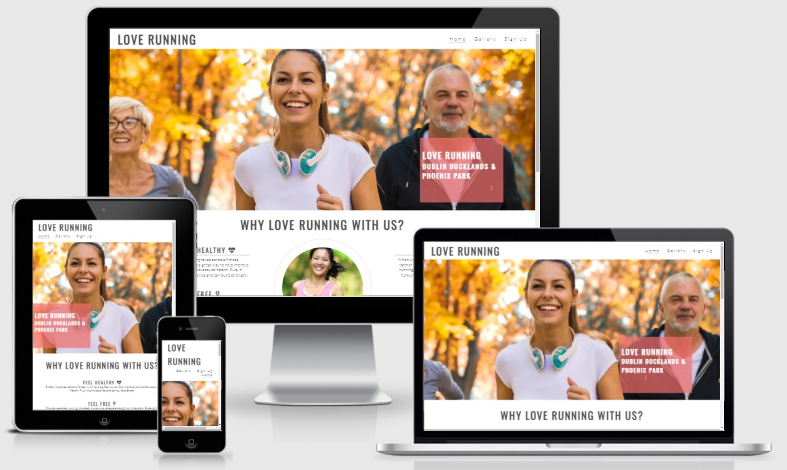

## Welcome from MaggieDaisy

This little project was one of my first websites developed during my coding journey with Code Institute. 
It uses simple front-end technology like HTML, CSS, and JS.

[**You can view live site here**](https://maggiedaisy.github.io/Love-Running/)

### Project aim: 
> Create a space for people who love running that they can be part of a community by:
- seeing a timetable with meetups 
- seeing photos taken during events
- having the possibility to sign up for a newsletter 
> Pages:
- Home - simple intro page
- Gallery - simple imagery presentation
- Sign Up - simple contact form

